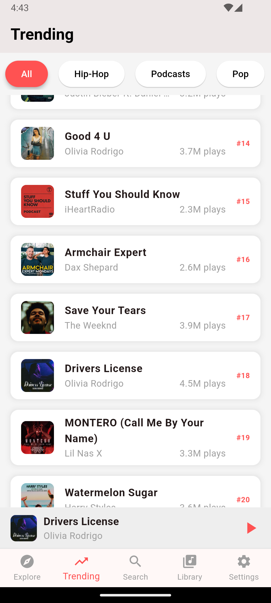

# Harmoniq - Flutter Music Player (One-Page Test Application)

This is a **one-page music player** application built with Flutter and Dart. The application showcases:
- A dynamic music list with categories.
- A scrollable filter bar to select categories like Hip-Hop, Pop, and Podcasts.
- A "Currently Playing" bar that updates when a music track is selected.

This project serves as a **test application** for learning Dart and Flutter.

---

## Features
- **Music List**:
  - Displays a list of trending music.
  - Includes title, artist, play count, and album art.
- **Scrollable Filter Bar**:
  - Filter music by categories such as Hip-Hop, Pop, Rock, and more.
- **Currently Playing Bar**:
  - Shows the currently selected track above the bottom navigation bar.
- **Bottom Navigation Bar**:
  - Includes placeholder icons for navigation (Explore, Trending, Search, Library, and Settings).

---

## Screenshots


---

## Installation and Usage

1. **Clone the Repository**:
   ```bash
   git clone <repository-download-link>
   cd <repository-folder>
   ```

2. **Install Dependencies**:
   Ensure you have Flutter installed on your system. Run:
   ```bash
   flutter pub get
   ```

3. **Run the Application**:
   ```bash
   flutter run
   ```

4. **Ensure Assets Are Loaded**:
   Add the following to your `pubspec.yaml` file:
   ```yaml
   flutter:
     uses-material-design: true
     assets:
       - assets/images/
   ```

   Then, make sure you have the following images in the `assets/images/` folder:
   - `Kohinoor.jpg`
   - `Titanium.jpg`
   - `Maradona_Riddim.jpg`
   - `Blinding_Lights.jpg`
   - `Levitating.jpg`
   - `Stay.jpg`
   - `Rockstar.jpg`
   - `Shape_Of_You.jpg`
   - `Bohemian_Rhapsody.jpg`
   - `Lose_Yourself.jpg`

5. **Customize the App**:
   Feel free to add more music tracks, categories, or modify the design.

---

## Requirements
- Flutter SDK: `>=3.0.0`
- Dart: `>=2.19.0`

---

## Project Structure
```
lib/
├── main.dart       # Main application file
assets/
└── images/         # Folder for album art images
```

---

## License
This is a test project and can be used freely for educational purposes.

---

## Download Link

You can download or clone this repository using the following link:

[Download Harmoniq Music Player](https://github.com/nathija-nimantha/harmoniq-music-player)
